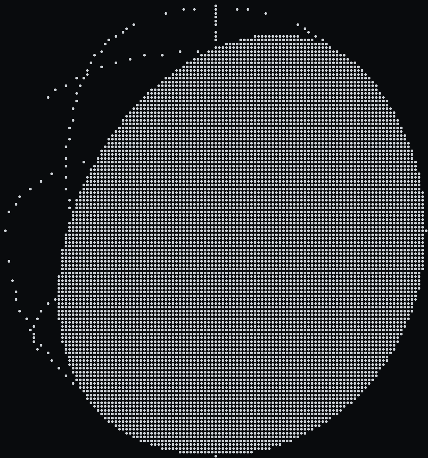

# spinning-globe

Animated ASCII art of a rotating 3D planet, rendered live in your terminal.
It auto-detects your terminal size every frame, so the globe resizes when you
resize the window, and it works on any system with a Python 3 interpreter
(pure standard library, no dependencies).

## Quick start

    python3 globe.py

That's it. The globe fills your terminal and spins in place until you press
Ctrl+C.

## Demo

*Braille charset (small terminal) rendering `--stars` over 20 seconds.*

## Options

    python3 globe.py --help

| Flag | Default | What it does |
|------|---------|--------------|
| `--fps`       | 20       | Frames per second (rotate faster, lower = slower spin) |
| `--speed`     | 1.0      | Rotation speed multiplier (can be negative to reverse) |
| `--tilt`      | 23.4     | Axial tilt in degrees (23.4° = Earth's real axial tilt) |
| `--charset`   | auto     | Rendering style; `auto` picks by terminal size |
| `--grid`      | on       | Overlay latitude/longitude lines (`on`/`off`) |
| `--stars`     | on       | Render a starfield behind the globe |
| `--seed`      | 0        | Starfield seed (deterministic background) |
| `--color`     | auto     | ANSI color shading (`auto`/`on`/`off`) |
| `--cols/--rows` | auto | Force a fixed terminal size (mainly for debugging) |

### Charsets

| Value | Characters | When to use |
|-------|-----------|-------------|
| `classic` | ` .:-=+*#%@` | Rich gradients — best on large terminals |
| `block` | ` ░▒▓█` | Solid block fills — good on medium screens |
| `solid` | `░▒▓█` | No darkest gap, so the disk stays filled — tiny terminals |
| `minimal` | ` .oO@` | Bold, few levels |
| `braille` | 2x4 dot grid per cell | **Sharpest on small terminals** — each cell becomes an 8-dot bitmap, ~8x the vertical detail, so a small globe still has smooth curves |

`auto` (default) picks **braille** when the terminal is small (under 80 cols or 24 rows) and **classic** on larger screens. On small terminal it also auto-drops the latitude/longitude grid, which otherwise overwhelms a tiny globe; pass `--grid on` to force it back.

## How it works

1. Every frame the script reads the current terminal size via
   `shutil.get_terminal_size()`, so it always fits exactly and reacts to
   window resizes.
2. Each cell inside the globe's bounding circle is mapped back onto the
   surface of a 3D unit sphere. The sphere's axis is tilted, and the whole
   thing rotates about the vertical (Y) axis.
3. A simple Lambert shading model computes how much light each surface
   point receives from a fixed light source and maps that brightness to a
   character from an ASCII ramp (` .:-=+*#%@` for the classic look).
4. Freely rotating, the shading pattern keeps the globe recognizably
   "spinning" instead of just wobbling.
5. A deterministic starfield (seeded via `--seed`) fills the blank space
   behind the globe each frame.

## Files

- `globe.py` — the whole program, pure stdlib (renders the globe + stars).
- `README.md` — this file.

## Ideas to extend

- Add a moon, or speed-controlled spin with arrow keys.
- Emit frames to a file or GIF via `--seren`-style flags for offline renders.
- Re-draw Earth's continents (a compact land mask) so the shaded globe shows real landmasses.
- Let the starfield twinkle (vary star brightness between frames).

MIT license — do whatever you want with it.
